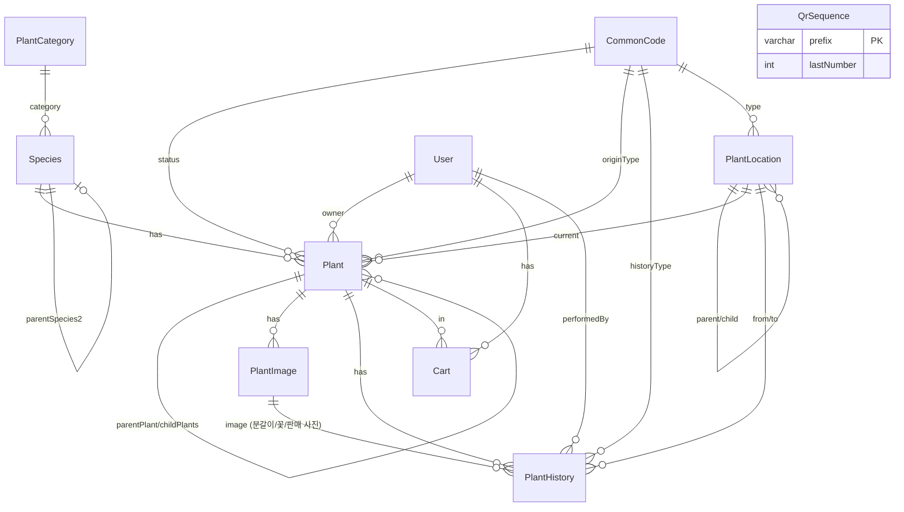

# Ask Plant — DB 명세서

## 0. 변경 이력

| 버전 | 일자 | 변경 내용 |
|------|------|-----------|
| v1.0 | 2026-07-04 | 최초 설계 (Species/Plant 분리, displayName 중심, QR 규칙, PlantHistory 등) |
| v1.1 | 2026-07-04 | **PlantCategory 추가**(Species.qrPrefix 제거), **OriginType → CommonCode 전환**, **PlantHistory.imageId 추가** |

> 본 개정(v1.1)은 기존 구조를 유지한 상태의 **소폭 개선**이다. 테이블 삭제나 대규모 재설계는 없다.

---

## 1. 개요

| 항목 | 내용 |
|------|------|
| 프로젝트 | Ask Plant — 다육식물 컬렉션 관리 시스템 |
| DBMS | PostgreSQL 15+ |
| ORM | Prisma 6.x |
| 스키마 파일 | `server/prisma/schema.prisma` |

### 1.1 설계 원칙

- **Species(품종)** 과 **Plant(개체)** 를 분리한다. Plant는 QR로 식별되는 실물 1개이다.
- **Species** 는 `displayName` 중심으로 관리한다 (학명 미상, sp, 유통명, 필드넘버 등 다육 시장 특성 반영).
- 모든 작업(분갈이, 판매, 위치변경, 개화, 메모, 번식 등)은 **PlantHistory** 에 기록한다.
- 코드성 값(상태, 이력 유형, 위치 유형, **기원 유형**)은 **CommonCode** 로 관리하여 테이블 구조 변경 없이 값을 확장한다.
- QR 접두사는 Species가 아닌 **PlantCategory** 1곳에서 관리한다 (품종마다 접두사를 중복 저장하지 않음).

---

## 2. ERD



### 2.1 관계 요약

```
PlantCategory ──▶ Species.category (1:N)               [NEW]
CommonCode    ──▶ Plant.status / Plant.originType /     [originType은 NEW: enum→FK]
                  PlantHistory.historyType / PlantLocation.type
User          ──▶ Plant.owner / Cart / PlantHistory.performedBy
Species       ──▶ Plant (1:N), Species (교배 부모 self-reference)
PlantLocation ──▶ Plant (현재 위치), PlantHistory (이동 전·후), self (계층)
Plant         ──▶ PlantImage, PlantHistory, Cart, Plant (번식 계보)
PlantImage    ──▶ PlantHistory.image (1:N)              [NEW: 이력에 사진 연결]
QrSequence    ──▶ (독립) QR 일련번호 관리, PlantCategory.code 와 연동
```

### 2.2 v1.1 변경점 요약

| 구분 | 변경 전 | 변경 후 |
|------|---------|---------|
| QR 접두사 | `Species.qrPrefix` (품종마다 저장) | `PlantCategory.code` (카테고리 1곳에서 관리), `Species.categoryId` 로 참조 |
| Plant 기원 | `Plant.originType` (Enum: PURCHASE/SEEDLING/CUTTING/OFFSET/GRAFT, 고정) | `Plant.originTypeId` → `CommonCode`(groupCode=`ORIGIN_TYPE`), 코드 추가만으로 확장 가능 |
| 이력-사진 연결 | 없음 | `PlantHistory.imageId` → `PlantImage` (nullable, `onDelete: SetNull`) |

---

## 3. Enum 정의

> `OriginType`은 v1.1에서 **Enum → CommonCode(ORIGIN_TYPE)** 로 전환되어 이 표에서 제외되었다. 자세한 내용은 [4장](#4-commoncode-그룹) 참고.

### 3.1 UserRole

| 값 | 설명 |
|----|------|
| `ADMIN` | 시스템 관리자 |
| `STAFF` | 재고·위치·이력 관리 직원 |
| `CUSTOMER` | 일반 고객 (구매·장바구니) |

### 3.2 TaxonRank

| 값 | 설명 | 예시 |
|----|------|------|
| `SPECIES` | 종 | `Conophytum truncatum` |
| `SP` | 미동정종 (sp.) | `Echeveria sp. 'Pink Ruby'` |
| `SSP` | 아종 (ssp.) | `Lithops fulviceps ssp. fulviceps` |
| `VARIETY` | 변종 | |
| `CULTIVAR` | cultivar | |
| `HYBRID` | 교배종 | |

### 3.3 ImageType

| 값 | 설명 |
|----|------|
| `PRIMARY` | 대표사진 |
| `FLOWER` | 꽃사진 |
| `SALE` | 판매사진 |
| `OTHER` | 기타 |

---

## 4. CommonCode 그룹

| groupCode | code | name | 용도 |
|-----------|------|------|------|
| `PLANT_STATUS` | `IN_STOCK` | 재고 | 개체 상태 |
| | `FOR_SALE` | 판매중 | |
| | `RESERVED` | 예약 | |
| | `SOLD` | 판매완료 | |
| | `DISCARDED` | 폐기 | |
| `HISTORY_TYPE` | `ACQUISITION` | 입고 | 이력 유형 |
| | `REPOT` | 분갈이 | |
| | `SALE` | 판매 | |
| | `LOCATION_CHANGE` | 위치변경 | |
| | `FLOWERING` | 개화 | |
| | `MEMO` | 메모 | |
| | `WATERING` | 물주기 | |
| | `PROPAGATION` | 번식 | **[NEW]** 분지/삽목/실생/복제 API 공통 이력 |
| `LOCATION_TYPE` | `GREENHOUSE` | 온실 | 위치 유형 |
| | `ZONE` | 구역 | |
| | `SHELF` | 선반 | |
| | `DISPLAY` | 전시 | |
| | `STORAGE` | 보관 | |
| `ORIGIN_TYPE` **[NEW]** | `PURCHASE` | 구매 | 개체 기원 (기존 enum 대체) |
| | `SEEDLING` | 실생 | |
| | `CUTTING` | 삽목 | |
| | `OFFSET` | 분지 | |
| | `GRAFT` | 접목 | |
| | `EXCHANGE` | 교환 | 향후 확장 코드 |
| | `DONATION` | 나눔 | 향후 확장 코드 |
| | `IMPORT` | 수입 | 향후 확장 코드 |
| | `SEED_COLLECTED` | 채종 | 향후 확장 코드 |

**제약:** `@@unique([groupCode, code])`

> `ORIGIN_TYPE`은 코드 행 추가만으로 새로운 기원 유형을 지원한다. 스키마(테이블) 변경이 필요 없다.

---

## 5. 테이블 명세

### 5.1 users

| 컬럼 | 타입 | Null | 기본값 | 설명 |
|------|------|------|--------|------|
| id | String (cuid) | N | auto | PK |
| email | String | N | | UK, 로그인 ID |
| passwordHash | String | N | | bcrypt 등 해시 |
| name | String | N | | 표시 이름 |
| phone | String | Y | | 연락처 |
| role | UserRole | N | CUSTOMER | 권한 |
| isActive | Boolean | N | true | 활성 여부 |
| createdAt | DateTime | N | now() | |
| updatedAt | DateTime | N | auto | |

**인덱스:** `email` (unique)

---

### 5.2 common_codes

| 컬럼 | 타입 | Null | 기본값 | 설명 |
|------|------|------|--------|------|
| id | String (cuid) | N | auto | PK |
| groupCode | String | N | | 코드 그룹 |
| code | String | N | | 그룹 내 코드 |
| name | String | N | | 표시명 |
| description | String | Y | | 설명 |
| sortOrder | Int | N | 0 | 정렬 순서 |
| isActive | Boolean | N | true | |
| createdAt | DateTime | N | now() | |
| updatedAt | DateTime | N | auto | |

**인덱스:** `(groupCode, code)` unique, `(groupCode, isActive)`

---

### 5.3 qr_sequences

QR 번호 발급용 접두사별 일련번호 카운터.

| 컬럼 | 타입 | Null | 기본값 | 설명 |
|------|------|------|--------|------|
| prefix | VarChar(3) | N | | PK, 예: CON, LTH |
| lastNumber | Int | N | 0 | 마지막 발급 번호 |
| updatedAt | DateTime | N | auto | |

**QR 번호 규칙**

```
{PREFIX}-{SEQUENCE(6자리)}
예) CON-000001, LTH-000042, OTH-000001
```

> **[v1.1 변경]** PREFIX의 근거가 `Species.qrPrefix` → **`Species.category.code`(PlantCategory)** 로 이동했다. 접두사를 품종마다 중복 저장하지 않고 카테고리 1곳에서 관리한다.

| PREFIX (PlantCategory.code) | 대상 |
|------------------------------|------|
| CON | Conophytum 계열 |
| LTH | Lithops 계열 |
| CAT | Cactus(선인장) 계열 |
| AFR | 아프리카 다육 계열 |
| OTH | 기타/미분류 |

**발급 절차**

1. `Species.categoryId` → `PlantCategory.code` 확인 (categoryId가 null이면 `OTH`)
2. 트랜잭션 내 `QrSequence` 행 lock → `lastNumber + 1`
3. `Plant.qrCode = "{prefix}-{pad6(lastNumber)}"` 저장

---

### 5.4 plant_categories **[NEW]**

Species의 대분류이자 QR 접두사의 유일한 근거.

| 컬럼 | 타입 | Null | 기본값 | 설명 |
|------|------|------|--------|------|
| id | String (cuid) | N | auto | PK |
| code | VarChar(3) | N | | UK, QR 접두사로 사용 (예: `LTH`) |
| name | String | N | | 표시명 (예: `Lithops 계열`) |
| description | String | Y | | 설명 |
| sortOrder | Int | N | 0 | 정렬 순서 |
| isActive | Boolean | N | true | |
| createdAt | DateTime | N | now() | |
| updatedAt | DateTime | N | auto | |

**시드 예시:** `CON`, `LTH`, `CAT`, `AFR`, `OTH`

**설계 의도:** `Species.qrPrefix`를 제거하고 이 테이블 하나로 접두사를 관리해, 동일 계열 품종이 늘어나도 접두사 불일치가 발생하지 않는다.

---

### 5.5 species

품종 마스터. **displayName 중심** 관리.

| 컬럼 | 타입 | Null | 기본값 | 설명 |
|------|------|------|--------|------|
| id | String (cuid) | N | auto | PK |
| displayName | String | N | | **UI·검색 기준 이름** |
| scientificName | String | Y | | 학명 (없을 수 있음) |
| englishName | String | Y | | 영문명 |
| koreanName | String | Y | | 국문명 |
| fieldNumber | String | Y | | 필드넘버 (SB1234 등) |
| sellerName | String | Y | | 판매자/육성자명 |
| taxonRank | TaxonRank | N | SPECIES | 분류 등급 |
| isHybrid | Boolean | N | false | 교배종 여부 |
| parentSpecies1Id | String | Y | | FK → species (교배 부모 1) |
| parentSpecies2Id | String | Y | | FK → species (교배 부모 2) |
| categoryId | String | Y | | **[변경]** FK → plant_categories (`qrPrefix` 컬럼 대체) |
| family | String | Y | | 과 |
| genus | String | Y | | 속 |
| description | String | Y | | 설명 |
| careGuide | String | Y | | 관리 가이드 |
| defaultWateringCycleDays | Int | Y | | 기본 물주기(일) |
| thumbnailUrl | String | Y | | 썸네일 URL |
| isActive | Boolean | N | true | |
| createdAt | DateTime | N | now() | |
| updatedAt | DateTime | N | auto | |

**인덱스:** displayName, scientificName, fieldNumber, genus, **categoryId**

**다육 시장 케이스 예시**

| 케이스 | 필드 조합 |
|--------|-----------|
| 학명 없음 + sp | displayName=`Echeveria sp. 'Pink Ruby'`, taxonRank=SP, scientificName=null |
| ssp | taxonRank=SSP |
| 교배종 | isHybrid=true, parentSpecies1Id/2Id 설정 |
| 필드넘버 | fieldNumber=`PVB 7891` |
| 유통명만 | displayName=`곰손이`, scientificName=null |
| 판매자명 | sellerName=`한국다육` |
| 분류 | categoryId → `PlantCategory(code=LTH)` |

---

### 5.6 plant_locations

위치 마스터. 계층 구조 + 지도 좌표 지원.

| 컬럼 | 타입 | Null | 기본값 | 설명 |
|------|------|------|--------|------|
| id | String (cuid) | N | auto | PK |
| code | String | N | | UK, 위치 코드 |
| name | String | N | | 위치명 |
| description | String | Y | | |
| typeId | String | Y | | FK → common_codes (LOCATION_TYPE) |
| parentId | String | Y | | FK → plant_locations (상위) |
| imagePath | String | Y | | 배치도/평면도 이미지 경로 |
| posX | Float | Y | | 지도 X (0.0~1.0, 상대좌표) |
| posY | Float | Y | | 지도 Y (0.0~1.0, 상대좌표) |
| sortOrder | Int | N | 0 | |
| isActive | Boolean | N | true | |
| createdAt | DateTime | N | now() | |
| updatedAt | DateTime | N | auto | |

**계층 예시**

```
온실 A (GREENHOUSE, imagePath=greenhouse-a.png)
  └─ 1구역 (ZONE, posX=0.2, posY=0.3)
       └─ 3번 선반 (SHELF, posX=0.25, posY=0.35)
```

---

### 5.7 plants

QR 개체. 다육 1개 = 1행.

| 컬럼 | 타입 | Null | 기본값 | 설명 |
|------|------|------|--------|------|
| id | String (cuid) | N | auto | PK |
| qrCode | String | N | | UK, QR 식별자 |
| nickname | String | Y | | 개체 별칭 |
| speciesId | String | N | | FK → species |
| locationId | String | Y | | FK → plant_locations |
| ownerId | String | Y | | FK → users (소유자) |
| parentPlantId | String | Y | | FK → plants (번식 원본) |
| statusId | String | N | | FK → common_codes (PLANT_STATUS) |
| originTypeId | String | N | | **[변경]** FK → common_codes (ORIGIN_TYPE), 기존 Enum 컬럼 `originType` 대체 |
| purchasePrice | Decimal(12,2) | Y | | 구매가 (관리자 전용) |
| sellingPrice | Decimal(12,2) | Y | | 판매가 |
| purchaseDate | DateTime | Y | | 구매일 |
| seedDate | DateTime | Y | | 파종/실생일 |
| potSize | String | Y | | 화분 크기 |
| memo | String | Y | | 메모 (관리자 전용) |
| soldAt | DateTime | Y | | 판매 완료일 |
| createdAt | DateTime | N | now() | |
| updatedAt | DateTime | N | auto | |

**인덱스:** speciesId, locationId, ownerId, parentPlantId, statusId, **originTypeId**

**번식 계보 예시**

```
Plant A (모株)
  ├── Plant B (originType=CUTTING, parentPlantId=A)
  └── Plant C (originType=OFFSET, parentPlantId=A)
```

**Public API 노출 제한:** `purchasePrice`, `memo`, `ownerId`, `parentPlantId` 등은 관리자 전용 정보로 Public API(`GET /public/plants/{qrCode}`)에서 절대 반환하지 않는다. 자세한 내용은 API 명세서 [12장. Public](./api-specification.md#12-public-v11-신규) 참고.

---

### 5.8 plant_images

| 컬럼 | 타입 | Null | 기본값 | 설명 |
|------|------|------|--------|------|
| id | String (cuid) | N | auto | PK |
| plantId | String | N | | FK → plants (CASCADE DELETE) |
| url | String | N | | 이미지 URL |
| imageType | ImageType | N | OTHER | 사진 유형 |
| caption | String | Y | | 캡션 |
| sortOrder | Int | N | 0 | |
| isPrimary | Boolean | N | false | 대표 여부 |
| createdAt | DateTime | N | now() | |

**인덱스:** plantId, (plantId, imageType)

**역참조 [NEW]:** `PlantHistory.imageId` 에서 이 테이블을 참조해 분갈이/꽃/판매 이력에 특정 사진을 연결할 수 있다.

---

### 5.9 plant_histories

개체의 모든 작업 이력.

| 컬럼 | 타입 | Null | 기본값 | 설명 |
|------|------|------|--------|------|
| id | String (cuid) | N | auto | PK |
| plantId | String | N | | FK → plants (CASCADE DELETE) |
| historyTypeId | String | N | | FK → common_codes (HISTORY_TYPE) |
| performedById | String | Y | | FK → users |
| performedAt | DateTime | N | now() | 작업 일시 |
| title | String | Y | | 제목 |
| description | String | Y | | 내용 |
| amount | Decimal(12,2) | Y | | 금액 (판매 등) |
| fromLocationId | String | Y | | FK → plant_locations (이동 전) |
| toLocationId | String | Y | | FK → plant_locations (이동 후) |
| imageId | String | Y | | **[NEW]** FK → plant_images (`onDelete: SetNull`) |
| metadata | Json | Y | | 유형별 추가 데이터 |
| createdAt | DateTime | N | now() | |

**이력 유형별 주요 필드**

| historyType | 주요 필드 | metadata 예시 |
|-------------|-----------|-----------------|
| ACQUISITION | description | `{ "source": "경매" }` |
| REPOT | title, description, **imageId** | `{ "potSize": "21cm", "soilMix": "배양토+펄라이트" }` |
| SALE | amount, performedById, **imageId** | `{ "buyerName": "홍길동", "paymentMethod": "CARD" }` |
| LOCATION_CHANGE | fromLocationId, toLocationId | — |
| FLOWERING | title, description, **imageId** | `{ "flowerColor": "yellow" }` |
| MEMO | description | — |
| WATERING | description | — |
| **PROPAGATION** [NEW] | title, description, **imageId** | `{ "method": "OFFSET", "sourcePlantId": "cuid" }` |

**imageId 활용 예:** 분갈이(REPOT) 전후 사진, 개화(FLOWERING) 사진, 판매(SALE) 시 촬영한 판매용 사진을 각각 `PlantImage` 레코드로 먼저 등록한 뒤 해당 `id`를 이력의 `imageId`로 연결한다.

**위치변경 시:** `Plant.locationId` 갱신 + `PlantHistory` 기록을 트랜잭션으로 처리.

---

### 5.10 carts

| 컬럼 | 타입 | Null | 기본값 | 설명 |
|------|------|------|--------|------|
| id | String (cuid) | N | auto | PK |
| userId | String | N | | FK → users (CASCADE DELETE) |
| plantId | String | N | | FK → plants (CASCADE DELETE) |
| quantity | Int | N | 1 | 수량 (개체는 보통 1) |
| createdAt | DateTime | N | now() | |
| updatedAt | DateTime | N | auto | |

**제약:** `(userId, plantId)` unique

---

## 6. 삭제 정책

| 관계 | onDelete |
|------|----------|
| Plant → PlantImage | CASCADE |
| Plant → PlantHistory | CASCADE |
| User → Cart | CASCADE |
| Plant → Cart | CASCADE |
| **PlantImage → PlantHistory.imageId** [NEW] | **SetNull** (사진 삭제 시 이력은 유지, 사진 연결만 해제) |
| 기타 FK | RESTRICT (기본) |

---

## 7. 향후 확장 (스키마 미반영 설계안)

아래는 **이번 개정에서 schema.prisma에 반영하지 않은** 설계안이다. API 명세서의 문의(Inquiry) 기능은 이 구조를 참고해 추후 마이그레이션으로 도입한다.

```
Inquiry (문의)
  id, name, phone, content, totalAmount, statusId(CommonCode: INQUIRY_STATUS),
  userId?, createdAt

InquiryItem (문의 시점 장바구니 스냅샷)
  id, inquiryId, plantId, qrCode, displayName, sellingPrice
  # Plant 가격/상태가 이후 바뀌어도 문의 시점 값을 보존하기 위해 스냅샷으로 저장

InquiryNotification (발송 이력 — 문자/카카오/이메일 확장 대비)
  id, inquiryId, channelId(CommonCode: INQUIRY_CHANNEL), status, sentAt

CommonCode 신규 그룹 (도입 시)
  INQUIRY_STATUS: NEW, IN_PROGRESS, DONE
  INQUIRY_CHANNEL: SMS, KAKAO, EMAIL
```

> PlantCategory 도입 사례와 동일하게, 실제 수요가 확정되면 이 설계안을 정식 스키마로 승격한다.

---

## 8. 마이그레이션

```bash
# Prisma Client 생성
npm run db:generate

# 마이그레이션 적용
npm run db:migrate

# Prisma Studio
npm run db:studio
```

**v1.1 마이그레이션 시 주의사항**

| 항목 | 내용 |
|------|------|
| `Species.qrPrefix` → `categoryId` | 기존 qrPrefix 값 기준으로 `PlantCategory`를 먼저 생성한 뒤 `categoryId` 백필 필요 |
| `Plant.originType`(enum) → `originTypeId` | `ORIGIN_TYPE` CommonCode 시드 선행 후 기존 enum 값 → 해당 code의 id로 매핑하여 백필 |
| `PlantHistory.imageId` | nullable 컬럼 추가이므로 기존 행은 `null`로 유지, 데이터 손실 없음 |

시드 데이터 참고: `server/prisma/seed-data.ts`
